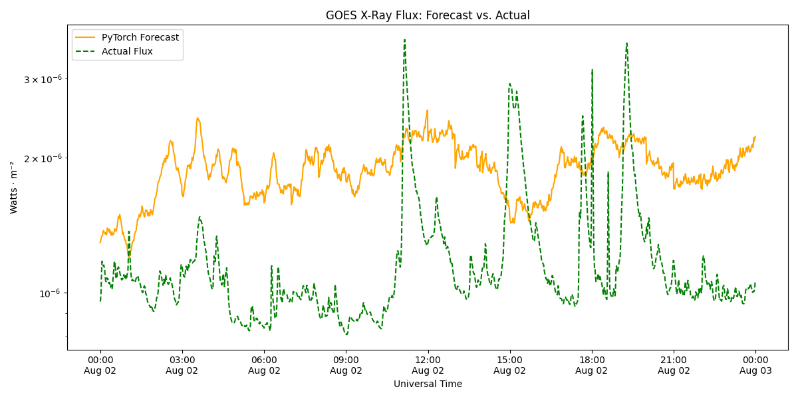
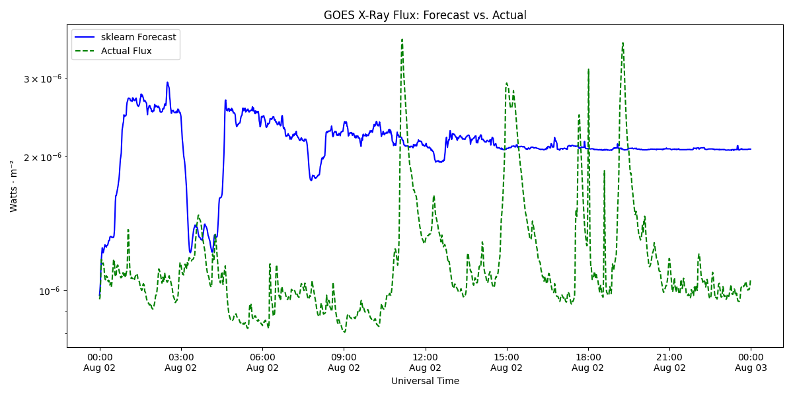

# SolarSense

**Forecasting solar flare activity 24 hours ahead from live NASA and NOAA satellite data.**

SolarSense pulls minute-by-minute X-ray readings from the GOES satellites, trains two machine learning models on them, and predicts the next day of solar activity. Each forecast is converted into the official NOAA flare classes (A, B, C, M, X) and shown in a web dashboard.


## Highlights

- **91% hourly flare-class accuracy** on held-out data, beating a persistence baseline (84.5%)
- **Direct 24-hour LSTM forecaster** that avoids the error buildup of recursive forecasting, in a 225 KB model
- **Three model approaches compared:** gradient boosting (scikit-learn), a recursive LSTM and a direct multi-step LSTM (PyTorch)
- **Real-world data:** 14 days of NASA archive data merged with NOAA's live API at 1-minute resolution
- **Full stack:** FastAPI backend runs the pipeline on demand, React dashboard with light/dark mode and mobile support

## Why it matters

Solar flares can disrupt GPS, radio communication, satellites and power grids. Airlines reroute polar flights, satellite operators delay maneuvers and grid operators prepare backup capacity when strong flares are expected.

SolarSense turns raw satellite data into a **24-hour early-warning forecast** that non-specialists can read at a glance: one flare class per hour, on a simple dashboard.

- **Decision support:** gives operations teams a day of lead time to plan around risky periods
- **Risk mitigation:** flags hours with elevated activity before they happen
- **Proven value over a simple rule:** 91% accuracy compared with 84.5% for "assume tomorrow looks like now"
- **Low-cost and scalable:** runs on free public NASA and NOAA data, with a lightweight 225 KB model that needs no special hardware

## How it works


1.  **Fetch.** Historical GOES readings come from NASA's archive (via SunPy) and the latest 7 days from NOAA's Space Weather API. The two are merged, duplicates removed and overlapping readings averaged.
2.  **Train.** Flux values are log-transformed and normalized, then used to train both models.
    - *Gradient boosting:* `HistGradientBoostingRegressor` (max depth 6, 500 iterations, learning rate 0.05). Looks at the last 12 hours to predict the next minute.
    - *Recursive LSTM:* 2 layers, 256 hidden units. Looks at the last 24 hours to predict the next 60 minutes, then feeds its own predictions back in 24 times.
    - *Direct LSTM (used in the web app):* reads the last 24 hours as 96 fifteen-minute steps and predicts all 24 upcoming hourly averages in one pass. Trained on 90 days of data with early stopping.
3.  **Predict.** Forecasts are converted back from log scale and labelled with a flare class.
4.  **Process.** Minute forecasts are averaged into hourly values.
5.  **Test.** Predicted flare classes are compared against what actually happened.
6.  **Plot.** Forecast and actual activity are graphed side by side.

## Results

**Direct 24-hour LSTM** (tested on the newest 15% of 90 days of data, never seen in training):

|                             | Direct LSTM           | Persistence baseline |
|-----------------------------|-----------------------|----------------------|
| Hourly flare-class accuracy | **91.0%**             | 84.5%                |
| Average error (log10 flux)  | **0.161**             | 0.215                |
| Error at hour 1 / 12 / 24   | 0.108 / 0.163 / 0.155 |                      |

The baseline assumes the next 24 hours look like the last hour. The model beats it by 6.5 points and cuts average error by about 25%, and its error stays flat across the day instead of growing.

**Earlier models** (single-day test): gradient boosting and the recursive LSTM both reached about 96% hourly class accuracy on one test day. The recursive LSTM tracked the curve for 6 to 7 hours, then drifted far below actual values.

**Recursive LSTM forecast vs. actual** 


**Gradient boosting forecast vs. actual** 

## Key findings

**Recursive forecasting compounds its own errors.** Feeding predictions back in as inputs made each hour build on the last hour's mistakes, so the original LSTM drifted after 6 to 7 hours. Predicting all 24 hours in one pass fixed this, and the error now stays flat across the day.

**Always compare against a baseline.** A simple "tomorrow looks like the last hour" rule already gets 84.5%, because the sun is often quiet. Beating it is what shows the model learned something.

**Accuracy depends on how you measure it.** Minute-level solar data is noisy, so matching the exact class every minute is hard (\~63%). Averaged by the hour, accuracy jumps to \~96%, which is the more useful measure for space weather planning.

**Gradient boosting and the recursive LSTM fail in opposite ways.** Gradient boosting underfits: stable labels, but it misses sudden changes. The LSTM can overfit on small datasets or too many epochs. Pick gradient boosting for a reliable label, the LSTM when the shape of the activity matters.

**Predict the value first, then classify.** Real data is mostly A, B and C class, with very few M and X flares. A classifier trained directly would mostly guess the common classes. Predicting raw flux and applying NOAA's thresholds afterward avoids that bias.

**Tiny numbers need special handling.** Flux values around 10⁻⁶ caused early misclassifications. A log transform before training fixed it.

**Real-world APIs fail, so plan for it.** NASA's archive throttles large downloads, so data collection uses retry and backoff logic.

## Dashboard

Pick any date with the arrow keys and the backend fetches data, runs the forecast and returns hourly flare classes in about 1 to 2 minutes. It also shows NASA's SDO daily sun video for that day.


## Tech stack

| Area             | Tools                                              |
|------------------|----------------------------------------------------|
| Machine learning | PyTorch, scikit-learn, pandas, NumPy               |
| Data sources     | SunPy (NASA GOES archive), NOAA SWPC API, NASA SDO |
| Backend          | FastAPI, Uvicorn                                   |
| Frontend         | React, Tailwind CSS, Recharts, Webpack             |
| Visualization    | Matplotlib                                         |

## Project structure

```         
SolarSense/
├── scripts/
│   ├── collect/fetch.py         # Download and clean GOES data
│   ├── model/                   # Train and predict (scikit-learn + PyTorch)
│   └── backend/                 # FastAPI server used by the web app
├── test/                        # Accuracy checks against real data
├── visuals/                     # Plot scripts and result charts
├── models/regressors/           # Trained models and scalers
├── data/processed/              # Sample training, seed and forecast data
├── docs/images/                 # README images
└── react-tailwind-vanilla/      # React dashboard
```

## Running it

Requires Python 3.10+ and Node.js 18+.

``` bash
pip install -r requirements.txt
```

### Web app

``` bash
# Terminal 1: backend
cd scripts/backend
uvicorn api:app --reload --port 8000

# Terminal 2: frontend
cd react-tailwind-vanilla
npm install
npm start
```

Open <http://localhost:8080>.

### Full training pipeline

Run from the project root. Dates and output file names are set at the top of each script.

``` bash
python scripts/model/train_direct.py --days 90   # direct LSTM used by the web app (downloads its own data)

# Original pipeline
python scripts/collect/fetch.py          # run 3 times: training data, seed day, actual day
python scripts/model/train_pytorch.py    # or train_sklearn.py
python scripts/model/predict_pytorch.py  # or predict_sklearn.py
python test/process_prediction.py        # optional: average to hourly
python test/test_prediction.py           # accuracy vs. actual
python visuals/graph_pytorch.py          # or graph_sklearn.py
```

## Next steps

- Predict sudden flares: the model tracks the overall level well but misses sharp spikes, so adding features like sunspot region data could help
- Oversample or weight rare M and X class flares so the models learn them better
- Train on a year or more of data (one 10-day period in the current 90 days was missing from the archive and filled by interpolation)
- Deploy the dashboard publicly so it runs without local setup

## Team

Started as a group project by Amanuel Kassa, William Phan and Gurmukh Kharod for CMPT 310 (Artificial Intelligence) at Simon Fraser University. Amanuel later expanded it independently, redesigning the forecaster as a direct 24-hour model, adding baseline evaluation on 90 days of data, and updating the pipeline to run on current library versions.

**Amanuel:** Designed the ETL pipeline that ingests and merges NASA GOES archive and NOAA real-time API data, including deduplication, log-scale feature transformation and normalization. Contributed to model development and tuning for both the gradient boosting and LSTM forecasters, co-built the recursive multi-step inference engine and GOES flare classification, and integrated the models into a FastAPI and React dashboard. Coordinated integration across the data, modeling and frontend workstreams, managed shared development on GitHub, and co-authored the technical documentation.

**William:** Architected and trained the PyTorch LSTM forecaster, including sequence windowing, dropout regularization and learning rate scheduling to reduce overfitting. Co-built the recursive multi-step inference engine and the data ingestion pipeline, ran model validation against historical data, and built the Matplotlib visualizations comparing forecasts with actual results.

**Gurmukh:** Developed the scikit-learn gradient boosting regressor, including hyperparameter tuning and sliding-window feature engineering. Co-built the GOES flare classification and recursive inference engine, led model validation that reached about 96% hourly classification accuracy, and contributed to the React and Recharts dashboard.
